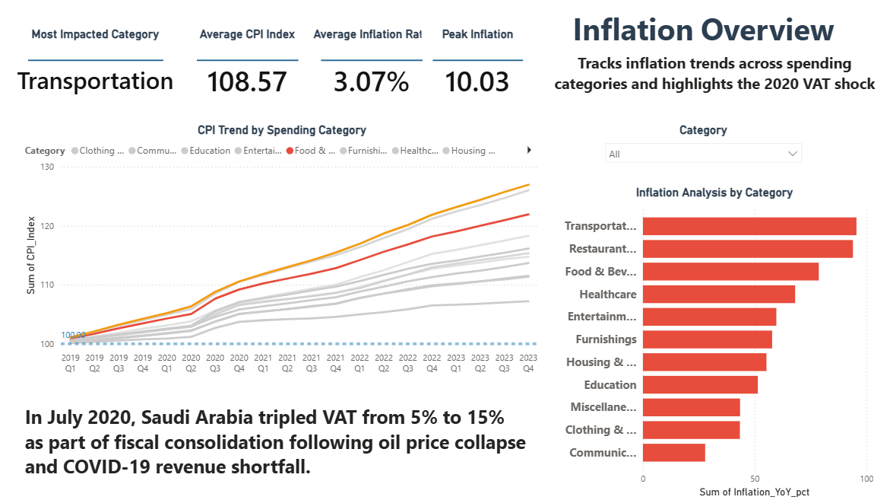
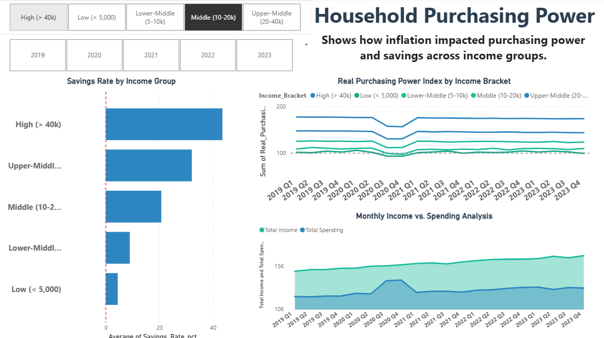
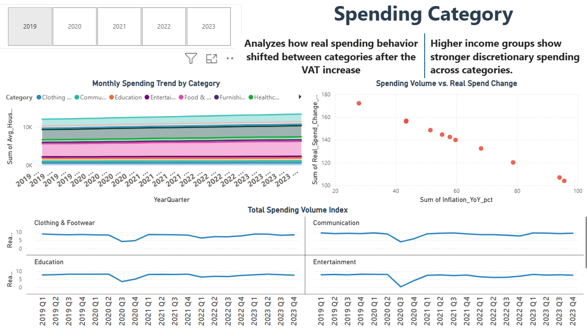
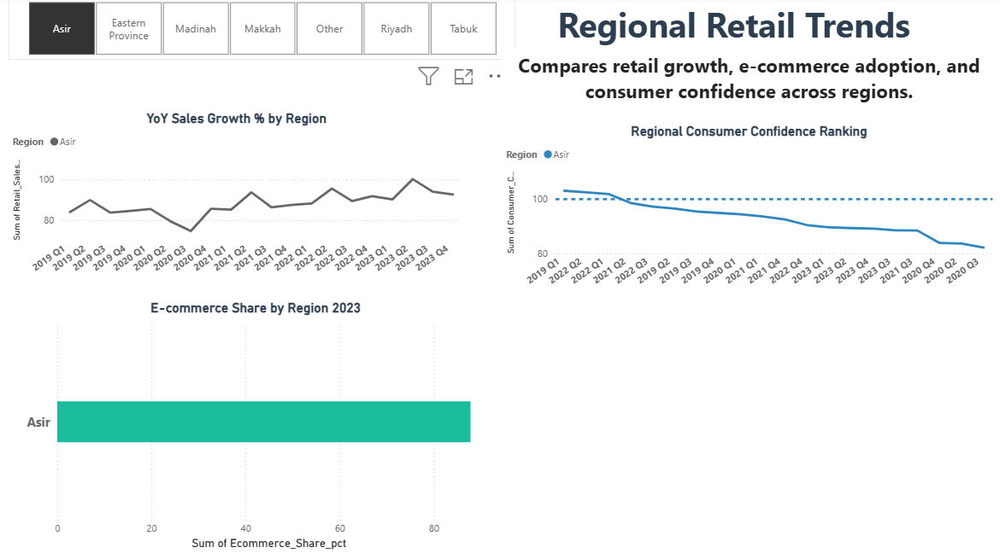

# Saudi Consumer Inflation Dashboard

This project is a Power BI dashboard focused on consumer inflation and spending patterns in Saudi Arabia.

I built it as part of my Power BI portfolio to practice turning economic and retail data into a clear dashboard. The report looks at inflation trends, household purchasing power, consumer spending, and regional retail activity.

## Why I Built This

I wanted this project to feel closer to a business reporting task than a simple charting exercise. Inflation affects households, retailers, and planning decisions, so the dashboard is built around questions a manager might ask when trying to understand changes in prices, spending, and purchasing power.

## Project Overview

The dashboard is designed to help answer questions like:

- How is inflation changing over time?
- Which areas of consumer spending are most affected?
- What does inflation mean for household purchasing power?
- Are there visible differences across regions or retail categories?

The project is more focused on dashboard-building and analysis practice than on creating a full production BI solution, but I tried to document it the way I would explain a workplace report.

## Dataset Description

The dataset is stored in the project `data` folder:

- `saudi_consumer_inflation_sample.csv`

This is synthetic sample data created for portfolio practice. It is intended to represent consumer inflation, household spending, and retail trend data related to Saudi Arabia, but it should not be treated as official economic data.

The dashboard uses this data structure to build summary KPIs, trend visuals, and comparison views.

The main Power BI file is:

`Saudi_Retail_Consumer_Spending_Dashboard (1).pbix`

## Data Structure

The sample CSV is a single flat table. Each row represents one month, region, and spending category.

| Column | Meaning |
| --- | --- |
| `Month` | Reporting month |
| `Region` | Region group used for comparison |
| `Category` | Consumer or retail category |
| `CPI_Index` | Sample consumer price index value |
| `Inflation_Rate` | Sample inflation rate percentage |
| `Household_Spending_SAR_M` | Household spending in SAR millions |
| `Retail_Sales_SAR_M` | Retail sales in SAR millions |
| `Purchasing_Power_Index` | Index showing relative purchasing power |

In a real company setting, I would normally separate this into a date table, category/region dimension tables, and a fact table. For this portfolio version, I kept the model simple so the focus stays on the dashboard and business story.

## KPI Definitions

| KPI | What it means |
| --- | --- |
| Average Inflation Rate | Average of `Inflation_Rate` across the selected period, region, or category |
| Average CPI Index | Average price index level for the selected filters |
| Household Spending | Sum of `Household_Spending_SAR_M` |
| Retail Sales | Sum of `Retail_Sales_SAR_M` |
| Purchasing Power Index | Average of `Purchasing_Power_Index`, used to compare affordability pressure |

## Example DAX Measures

These are the types of measures used or intended for this report:

```DAX
Total Household Spending =
SUM('Consumer Inflation'[Household_Spending_SAR_M])

Total Retail Sales =
SUM('Consumer Inflation'[Retail_Sales_SAR_M])

Average Inflation Rate =
AVERAGE('Consumer Inflation'[Inflation_Rate])

Average CPI Index =
AVERAGE('Consumer Inflation'[CPI_Index])

Average Purchasing Power =
AVERAGE('Consumer Inflation'[Purchasing_Power_Index])
```

If I expanded this project, I would add month-over-month and year-over-year measures using a proper date table.

## Dashboard Pages

The report includes four main pages:

1. **Inflation Overview**  
   A high-level view of inflation trends and headline indicators.

2. **Household Purchasing Power**  
   Looks at how inflation can affect household spending and affordability.

3. **Spending Deep Dive**  
   Breaks down consumer spending patterns in more detail.

4. **Regional Retail Trends**  
   Compares retail activity and trends across regions.

## How A Manager Could Use This Dashboard

- Start with the Inflation Overview page to see the general price trend.
- Use the Household Purchasing Power page to understand whether inflation is putting pressure on affordability.
- Use the Spending Deep Dive page to compare which categories are moving differently.
- Use the Regional Retail Trends page to check if one region is behaving differently from the others.
- Use filters to narrow the dashboard by month, region, or category before making a decision.

## Key Insights

Some of the main insights this dashboard is built to explore:

- Inflation trends can affect purchasing power even when spending stays active.
- Consumer categories do not all move the same way, so it helps to compare them separately.
- Regional views can show differences that are hidden in national-level totals.
- A dashboard with separate pages makes it easier to move from a broad overview into more specific details.

## What I Practiced

- Importing CSV-style data into Power BI
- Building KPI cards and trend visuals
- Designing multiple report pages around different business questions
- Writing simple DAX measures for totals and averages
- Organizing screenshots and documentation for GitHub
- Explaining the purpose and limitations of the dashboard clearly

## Screenshots

### Inflation Overview



### Household Purchasing Power



### Spending Deep Dive



### Regional Retail Trends



## Limitations

- The dashboard uses synthetic portfolio data, so the numbers are for practice and presentation only.
- The analysis is limited by the columns and time period included in the sample dataset.
- Some measures and insights may need more context from official economic sources before being used for real business decisions.
- This is a portfolio project, so the focus is on showing Power BI skills and analysis structure.
- The `.pbix` file is included, but Power BI Desktop is required to open and explore it fully.
- The current version uses a simple single-table model. A production version would use a cleaner star schema and a date table.

## How To Open The PBIX File

1. Download or clone this repository.
2. Open Power BI Desktop.
3. Open `Saudi_Retail_Consumer_Spending_Dashboard (1).pbix`.
4. If Power BI asks for data source permissions, review the paths and reconnect the files from the `data` folder if needed.

The screenshots above can be viewed directly on GitHub without opening Power BI.
