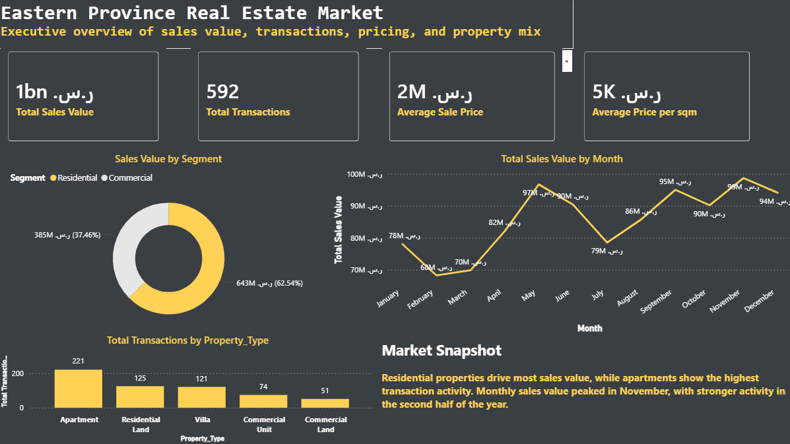
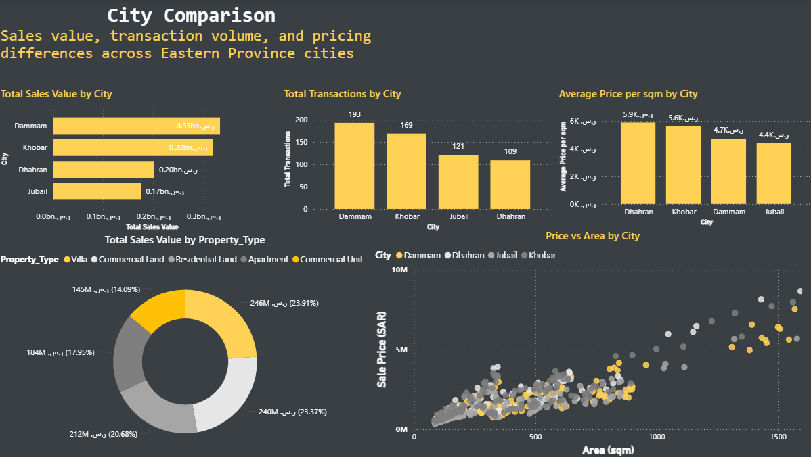
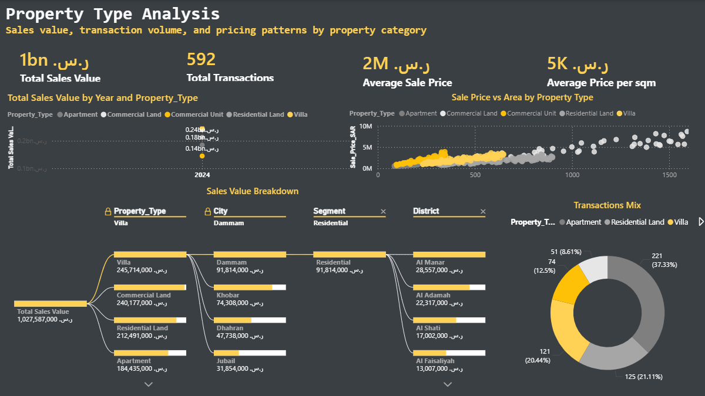

# Eastern Province Real Estate Market Dashboard

This is my second Power BI dashboard project. I built it to practice turning transaction-level real estate data into a cleaner business dashboard with pages for executive overview, city comparison, and property type analysis.

The project focuses on Eastern Province cities: Dammam, Khobar, Dhahran, and Jubail.

## Tools Used

- Power BI Desktop
- CSV data
- DAX measures
- Power BI theme formatting

## Dataset

The dataset is a synthetic real estate transaction dataset created for portfolio practice. It includes transaction date, city, district, property type, segment, area, sale price, and price per square meter.

This is not official government real estate data. I used a synthetic dataset so I could practice dashboard design, DAX, and storytelling without using private or restricted data.

## Dashboard Pages

### Executive Overview

This page gives a quick market summary with KPI cards, sales value by segment, monthly sales value trend, and transaction activity by property type.

### City Comparison

This page compares Dammam, Khobar, Dhahran, and Jubail by sales value, transaction volume, average price per square meter, property type mix, and price versus area.

### Property Type Analysis

This page looks deeper into property categories. It includes KPIs, property type trends, a price versus area scatter plot, a decomposition tree, and transaction mix.

## Screenshots

### Executive Overview

### City Comparison

### Property Type Analysis

## Key Insights

- Residential properties make up the largest share of total sales value.
- Apartments have the highest transaction activity.
- Dammam and Khobar lead the market by total sales value.
- Higher-area properties generally show higher sale prices, which is clear in the scatter plots.
- Monthly sales value was stronger in the second half of the year, with the highest month near the end of the year.

## Files

| File | Purpose |
| --- | --- |
| `data/eastern-province-real-estate-dashboard.pbix` | Finished Power BI dashboard file |
| `data/eastern_province_real_estate_transactions.csv` | Synthetic transaction-level dataset |
| `real_estate_theme.json` | Power BI theme file used for the dashboard style |
| `generate_dataset.py` | Script used to create the synthetic dataset |
| `docs/DAX_MEASURES.md` | DAX measures used in the report |
| `docs/POWER_BI_BUILD_GUIDE.md` | Notes from the build process |
| `docs/PROJECT_BRIEF.md` | Project idea and business questions |

## How To Open

1. Download or clone this repository.
2. Open `data/eastern-province-real-estate-dashboard.pbix` in Power BI Desktop.
3. If Power BI asks about the data source, point it to `data/eastern_province_real_estate_transactions.csv`.
4. Review the three report pages: Executive Overview, City Comparison, and Property Type Analysis.

## Limitations

This project is mainly for learning and portfolio practice. The dataset is synthetic, so the dashboard should not be used to make real investment or market decisions. The value is in the dashboard structure, visual design, DAX practice, and the way the analysis is presented.
